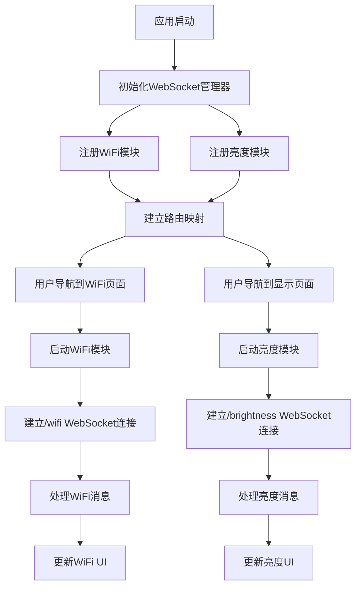

# WebSocket架构重构产品需求文档

## 1. 产品概述

本项目旨在完全重构Flutter Linux面板应用的WebSocket实现，创建模块化、可扩展的架构系统。重构后的系统将支持WiFi配置和亮度控制两个核心模块，并为未来功能扩展奠定坚实基础。

* 解决现有WebSocket实现中的连接冲突和状态混乱问题

* 建立完全解耦的模块化架构，支持独立开发和维护

* 提供统一的WebSocket路由分发机制，便于新功能模块接入

## 2. 核心功能

### 2.1 用户角色

本系统为单用户桌面应用，无需区分用户角色。所有功能对系统用户开放。

### 2.2 功能模块

重构后的WebSocket系统包含以下核心页面和模块：

1. **WiFi设置页面**：网络连接管理，包括WiFi开关、网络扫描、连接配置
2. **显示设置页面**：屏幕亮度控制，包括手动亮度调节、自动亮度开关
3. **WebSocket管理后台**：模块注册、路由分发、连接管理（后台服务）

### 2.3 页面详情

| 页面名称          | 模块名称     | 功能描述                   |
| ------------- | -------- | ---------------------- |
| WiFi设置页面      | WiFi开关控制 | 启用/禁用WiFi功能，显示当前WiFi状态 |
| WiFi设置页面      | 网络扫描     | 扫描可用WiFi网络，显示信号强度和安全类型 |
| WiFi设置页面      | 网络连接     | 连接到选定WiFi网络，输入密码验证     |
| WiFi设置页面      | 连接状态显示   | 显示当前连接的网络信息，支持断开操作     |
| WiFi设置页面      | 错误处理     | 显示连接错误信息，提供重试机制        |
| 显示设置页面        | 亮度滑块控制   | 手动调节屏幕亮度，实时预览效果        |
| 显示设置页面        | 自动亮度开关   | 启用/禁用自动亮度调节功能          |
| 显示设置页面        | 亮度状态显示   | 显示当前亮度值和自动亮度状态         |
| 显示设置页面        | 错误处理     | 显示亮度控制错误信息，提供重试机制      |
| WebSocket管理后台 | 模块注册器    | 注册和注销WebSocket处理模块     |
| WebSocket管理后台 | 路由分发器    | 根据WebSocket路径分发消息到对应模块 |
| WebSocket管理后台 | 连接管理器    | 管理WebSocket连接的建立、维护和断开 |
| WebSocket管理后台 | 错误恢复     | 处理连接异常，实现自动重连机制        |

## 3. 核心流程

### 3.1 WiFi配置流程

用户进入WiFi设置页面 → 系统初始化WiFi模块 → 建立WebSocket连接(/wifi) → 获取WiFi状态 → 用户执行WiFi操作(开关/扫描/连接) → 系统发送WebSocket请求 → 接收服务器响应 → 更新UI状态

### 3.2 亮度控制流程

用户进入显示设置页面 → 系统初始化亮度模块 → 建立WebSocket连接(/brightness) → 获取当前亮度状态 → 用户调节亮度或切换自动模式 → 系统发送WebSocket请求 → 接收服务器响应 → 更新UI显示

### 3.3 模块管理流程

应用启动 → 初始化WebSocket管理器 → 注册WiFi和亮度模块 → 建立路由映射 → 监听页面导航事件 → 按需启动对应模块 → 处理模块间通信 → 应用关闭时清理资源

## 4. 用户界面设计

### 4.1 设计风格

* **主色调**：深蓝色(#1976D2)作为主色，浅灰色(#F5F5F5)作为背景色

* **按钮样式**：圆角矩形按钮，支持悬停和点击状态变化

* **字体**：系统默认字体，标题使用16px，正文使用14px，说明文字使用12px

* **布局风格**：卡片式布局，清晰的模块分区，顶部导航栏设计

* **图标风格**：使用Material Design图标，保持一致的视觉风格

### 4.2 页面设计概览

| 页面名称     | 模块名称     | UI元素                         |
| -------- | -------- | ---------------------------- |
| WiFi设置页面 | WiFi开关控制 | 切换开关组件，状态指示灯，当前状态文字说明        |
| WiFi设置页面 | 网络列表     | 卡片式网络列表，信号强度图标，安全类型标识，连接状态标记 |
| WiFi设置页面 | 连接对话框    | 模态对话框，密码输入框，连接/取消按钮，加载指示器    |
| WiFi设置页面 | 错误提示     | 红色错误横幅，错误图标，错误描述文字，重试按钮      |
| 显示设置页面   | 亮度控制     | 水平滑块组件，当前亮度数值显示，亮度图标         |
| 显示设置页面   | 自动亮度     | 切换开关组件，功能说明文字，状态指示           |
| 显示设置页面   | 预览区域     | 模拟屏幕预览，实时亮度效果展示              |
| 显示设置页面   | 错误提示     | 橙色警告横幅，警告图标，错误描述文字，重试按钮      |

### 4.3 响应式设计

* **桌面优先设计**：主要针对桌面环境优化，最小窗口宽度800px

* **自适应布局**：支持窗口大小调整，组件自动重排

* **触摸优化**：虽然主要为桌面设计，但保持触摸友好的交互元素大小

## 5. 技术规范

### 5.1 WebSocket连接规范

* **服务器地址**：172.20.10.2:8080

* **WiFi模块路径**：/wifi

* **亮度模块路径**：/brightness

* **连接超时**：10秒

* **重连间隔**：5秒

* **心跳间隔**：30秒

### 5.2 消息格式规范

* **请求消息**：包含type、request\_id、data字段

* **响应消息**：包含type、request\_id、error\_code、data字段

* **事件消息**：包含type、data字段，用于服务器主动推送

* **错误处理**：统一的错误码定义，详细的错误描述

### 5.3 模块接口规范

* **模块标识**：唯一的模块ID标识

* **生命周期**：initialize、start、stop、dispose方法

* **消息处理**：handleMessage、handleEvent方法

* **状态管理**：连接状态流、事件流、错误流

## 6. 性能要求

### 6.1 响应时间要求

* **WebSocket连接建立**：< 3秒

* **消息发送响应**：< 1秒

* **UI状态更新**：< 500毫秒

* **页面切换**：< 300毫秒

### 6.2 稳定性要求

* **连接稳定性**：支持网络中断后自动重连

* **内存管理**：无内存泄漏，及时释放资源

* **错误恢复**：异常情况下能够自动恢复正常功能

* **并发处理**：支持多个模块同时运行

### 6.3 扩展性要求

* **模块热插拔**：支持运行时动态加载新模块

* **配置可变**：WebSocket地址和参数可配置

* **接口向后兼容**：新版本保持API兼容性

* **文档完整**：提供详细的开发文档和示例代码

## 7. 测试要求

### 7.1 功能测试

* **WiFi功能测试**：开关控制、网络扫描、连接断开功能

* **亮度功能测试**：手动调节、自动模式、状态同步功能

* **错误处理测试**：网络异常、服务器错误、超时处理

### 7.2 性能测试

* **连接性能测试**：大量连接建立和断开测试

* **消息吞吐测试**：高频消息发送接收测试

* **内存泄漏测试**：长时间运行内存使用监控

### 7.3 兼容性测试

* **系统兼容性**：不同Linux发行版测试

* **网络环境测试**：不同网络条件下的功能验证

* **并发测试**：多模块同时运行的稳定性测试

## 8. 部署要求

### 8.1 环境要求

* **Flutter版本**：>= 3.0.0

* **Dart版本**：>= 2.17.0

* **Linux系统**：支持主流发行版

* **网络要求**：能够访问172.20.10.2:8080

### 8.2 配置要求

* **WebSocket服务器**：确保服务器正常运行

* **权限配置**：应用需要网络访问权限

* **防火墙设置**：开放8080端口访问

* **日志配置**：配置适当的日志级别

### 8.3 监控要求

* **连接监控**：监控WebSocket连接状态

* **性能监控**：监控消息处理性能

* **错误监控**：记录和分析错误日志

* **用户行为监控**：记录用户操作统计

